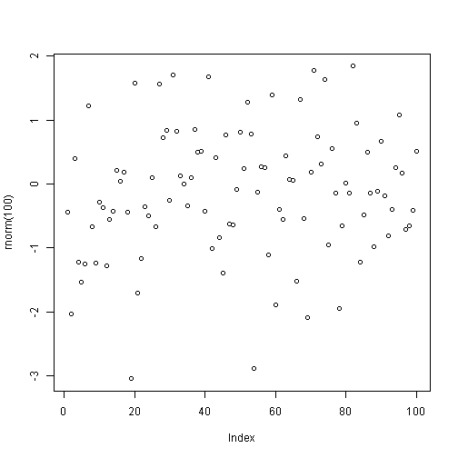

# Reproducible Research: Peer Assessment 1

```r
1+1
```

```
## [1] 2
```


## Loading and preprocessing the data

```r
plot(rnorm(100))
```

 


## What is mean total number of steps taken per day?


## What is the average daily activity pattern?


## Imputing missing values


## Are there differences in activity patterns between weekdays and weekends?
